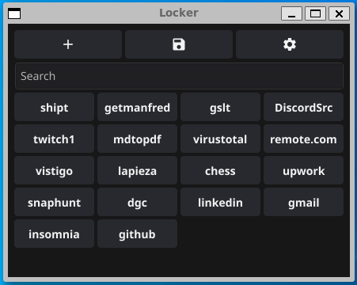
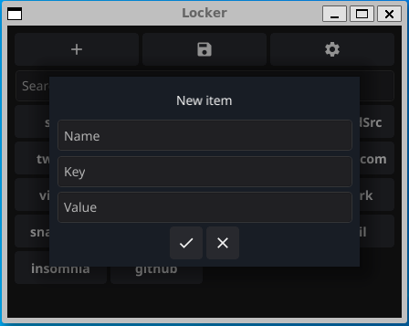
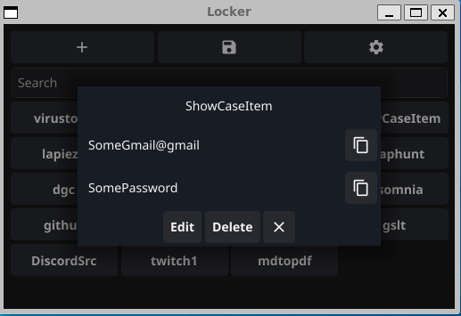
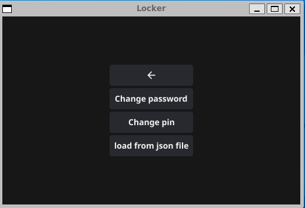

# Locker

## small app to store your password in safe
- copy, build and use. it will get u through initialization.
- make sure to have your system  [Dependecies](https://docs.fyne.io/started/)
- leave me your star
---
### after this quick path things u can go 
### Set on your .profile or .bashrc
        export LOCKER_PATH=path/to/lockerDir
        export PATH=$PATH:$LOCKER_PATH
#### in my case is
        export LOCKER_PATH=/home/<username>/.locker
        export PATH=$PATH:$LOCKER_PATH
#### .locker is the folder where it will be the binary and the locker.txt (file where u data will be saved encrypted)
#### Despite the lack of design because fyne tool does not offer many options to customize, it is quite useful
 
 
 
 